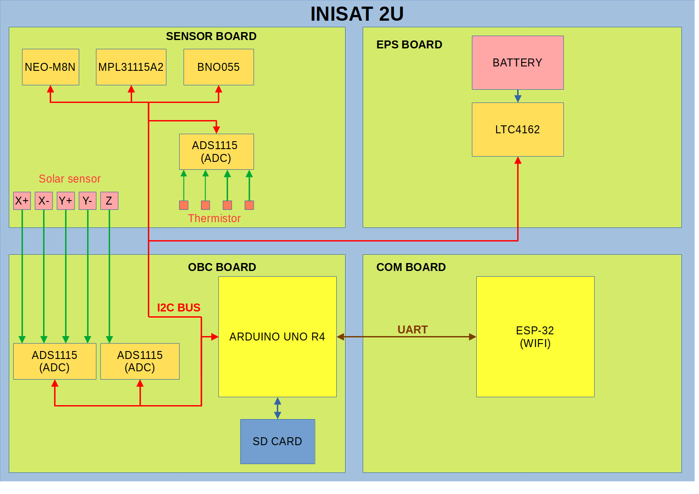
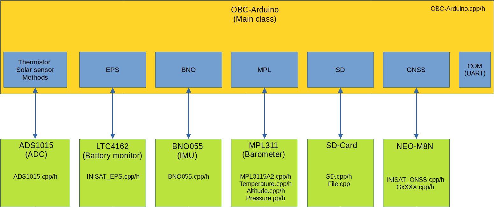

# OBC-Arduino

## Introduction

This library is designed to communicate with the various sensors on the INISAT 2U test bench.

All sensors are connected to a single I2C bus, allowing data to be sent to the COM board. The COM board includes WiFi connectivity, enabling data retrieval on a PC.
An SD card can be used for data logging.

**List of sensors on the I2C port:**

- ADS1115 X3 - Analog-to-digital converter for thermistor and solar panel voltage measurements.
- BNO055 - 9-axis inertial measurement unit (IMU).
- LTC4162 - Battery charge management.
- MPL3115A2 - Barometric pressure/altitude/temperature sensor.
- NEO-M8N - Receiver for GPS, Galileo, GLONASS, and BeiDou systems.

### Simplified hardware diagram.



## Composition of the library

The library includes a high-level class, OBC_Arduino, which serves as the entry point for controlling the entire system.
Each sensor is managed through a dedicated class included in OBC_Arduino.

### Simplified software diagram.



## Simple example

To use library import ```#include <OBC_Arduino.h>``` and initialize library with ```OBC.begin();``` (All sensor will be initialised), Serial can be use for debuging purpose.

This example initialize library and read X+ solar sensor voltage.

```c
#include <OBC_Arduino.h>
#include <string.h>

OBC_Arduino OBC;

void setup() {
  //Debuging use.
  Serial.begin(); 

  //Initialise OBC library
  OBC.begin(); 
}

void loop() {

  // Read solar voltage
  float xp = OBC.XP_readVolatge();
  Serial.print("X+ = ");
  Serial.print(xp);
  Serial.println("V");
  delay(1000);
}
```

## Detailed Description of Each Sub-library

- [Solar and Thermistor](Solar_thermistor.md)
- [BNO055 - 9-axis Inertial Measurement Unit (IMU)](BNO055.md)
- [LTC4162 - Battery Charge Management](LTC4162.md)
- [MPL3115A2 - Barometric Pressure/Altitude/Temperature Sensor](MPL.md)
- [NEO-M8N - Receiver for GPS, Galileo, GLONASS, and BeiDou Systems](GNSS.md)
- [SD Card](SD.md)
